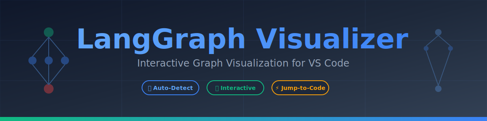
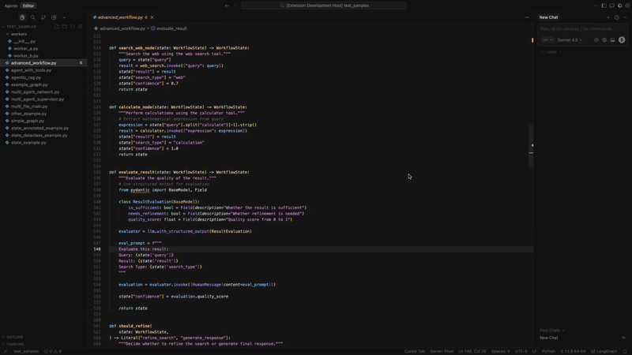
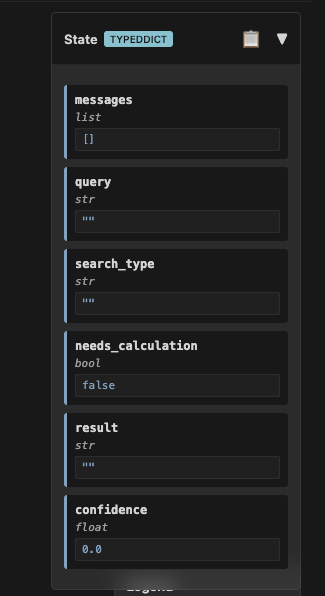
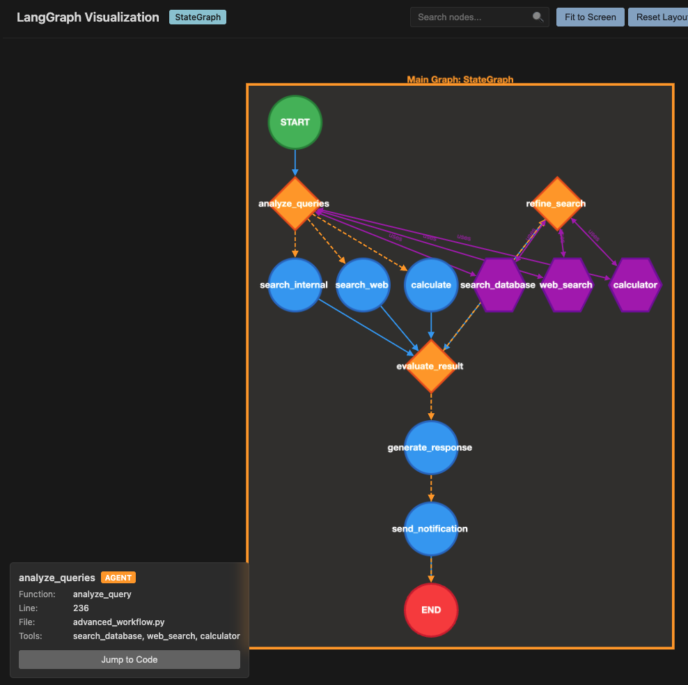
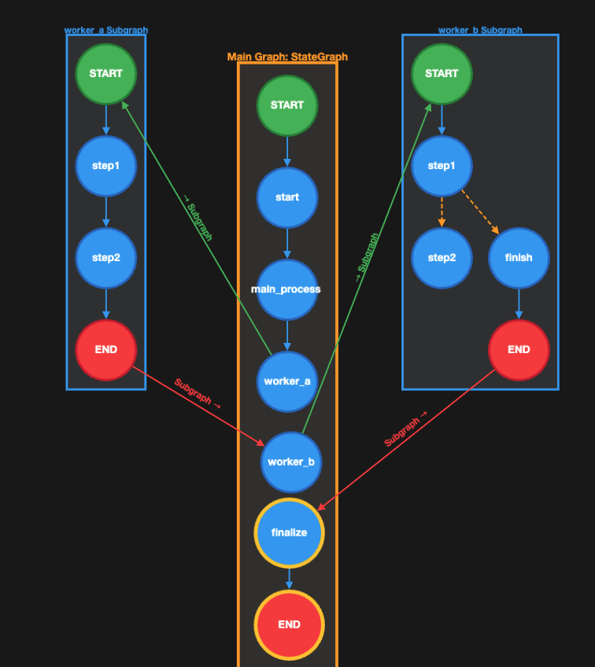

<div align="center">



# LangGraph Visualizer

**Interactive visualization of LangGraph graphs directly in VS Code**

[](https://marketplace.visualstudio.com/items?itemName=smazee.langgraph-visualizer)
[](https://marketplace.visualstudio.com/items?itemName=smazee.langgraph-visualizer)
[](https://marketplace.visualstudio.com/items?itemName=smazee.langgraph-visualizer)
[](./LICENSE)

[Features](#-features) • [Quick Start](#-quick-start) • [Usage](#-usage) • [Examples](#-examples) • [Development](#-development)

</div>

---

## 🎥 See It In Action

<div align="center">



*Visualize, interact, and navigate your LangGraph code with ease*

</div>

---

## ✨ Features

<table>
<tr>
<td width="50%">

### 🎯 **Auto-Detection**
Automatically detects LangGraph code in Python files
- Supports StateGraph, MessageGraph, and Graph
- Real-time detection as you code
- Status bar indicator when graphs are found

</td>
<td width="50%">

### 🚀 **Interactive Visualization**
Beautiful, interactive graph powered by Cytoscape.js
- Drag and reposition nodes
- Zoom and pan with smooth controls
- Hierarchical auto-layout (Dagre)

</td>
</tr>
<tr>
<td width="50%">

### ⚡ **Jump to Code**
Click any node to jump directly to its definition
- Instant navigation to function definitions
- Shows line numbers and function names
- Context-aware node details

</td>
<td width="50%">

### 🔍 **Search & Filter**
Find nodes instantly with real-time search
- Keyboard shortcut: `Cmd/Ctrl + F`
- Highlights matching nodes
- Clear with `Esc`

</td>
</tr>
<tr>
<td width="50%">

### 📊 **State Visualization**
View graph state definitions in a collapsible panel
- Shows all state fields with types
- Displays default values
- Copy state structure as JSON
- Supports TypedDict, dataclass, and MessagesState

</td>
<td width="50%">

### 📸 **Export**
Save your graph as PNG for documentation
- High-resolution exports
- Perfect for sharing and documentation
- One-click download

</td>
</tr>
</table>

### 📸 Feature Showcase

<div align="center">

<table>
<tr>
<td width="50%">

**State Visualization Panel**



*View state fields, types, and default values*

</td>
<td width="50%">

**Agent Nodes with Tools**



*Complex graphs with agent nodes and tool integrations*

</td>
</tr>
<tr>
<td colspan="2">

**Multi-File Graph Support**



*Automatically detects and visualizes graphs across multiple files*

</td>
</tr>
</table>

</div>

---

## 🚀 Quick Start

### Installation

1. **From VS Code Marketplace** (Recommended)
   - Open VS Code
   - Press `Cmd/Ctrl + Shift + X` to open Extensions
   - Search for "LangGraph Visualizer"
   - Click **Install**

2. **From VSIX File**
   ```bash
   code --install-extension langgraph-visualizer-0.2.0.vsix
   ```

### First Use

1. Open any Python file with LangGraph code
2. Look for the **$(graph) LangGraph** icon in the status bar (bottom right)
3. Click the icon to visualize your graph
4. Interact with the visualization!

---

## 🎮 Usage

### Opening the Visualizer

There are multiple ways to open the visualizer:

| Method | Description |
|--------|-------------|
| **Status Bar** | Click the `$(graph) LangGraph` icon when detected |
| **Command Palette** | `Cmd/Ctrl + Shift + P` → "Show LangGraph Visualization" |
| **Context Menu** | Right-click in editor → "Show LangGraph Visualization" |
| **File Explorer** | Right-click Python file → "Show LangGraph Visualization" |

### Interacting with the Graph

<table>
<tr>
<th>Action</th>
<th>How To</th>
<th>Result</th>
</tr>
<tr>
<td><strong>🖱️ Drag Nodes</strong></td>
<td>Click and drag any node</td>
<td>Repositions the node</td>
</tr>
<tr>
<td><strong>🔍 Zoom</strong></td>
<td>Mouse wheel or zoom buttons</td>
<td>Zoom in/out on the graph</td>
</tr>
<tr>
<td><strong>👆 Pan</strong></td>
<td>Click and drag background</td>
<td>Move around the graph</td>
</tr>
<tr>
<td><strong>🎯 Select Node</strong></td>
<td>Click any node</td>
<td>Shows node details, jump to code</td>
</tr>
<tr>
<td><strong>🔎 Search</strong></td>
<td><code>Cmd/Ctrl + F</code> or search box</td>
<td>Highlights matching nodes</td>
</tr>
<tr>
<td><strong>📐 Center Graph</strong></td>
<td>Click center button</td>
<td>Fits graph to view</td>
</tr>
<tr>
<td><strong>📸 Export</strong></td>
<td>Click export button</td>
<td>Downloads PNG image</td>
</tr>
</table>

### Understanding the Visualization

#### Node Colors

- 🟢 **Green** = Start/Entry Point
- 🔵 **Blue** = Regular Node
- 🔴 **Red** = End/Finish Point
- 🟣 **Purple** = Conditional Node

#### Edge Types

- **Solid Line** = Direct Edge
- **Dashed Line** = Conditional Edge

#### State Panel

The collapsible state panel (top-right) shows:
- **Field Names** and their types
- **Default Values** or example values
- **Annotations** (e.g., `add_messages`)
- **Copy to Clipboard** button (📋)

---

## 📝 Examples

### Simple Graph

```python
from typing import TypedDict
from langgraph.graph import StateGraph

class State(TypedDict):
    messages: list[str]
    user_input: str
    response: str

# Create graph
graph = StateGraph(State)

# Add nodes
graph.add_node("start", start_function)
graph.add_node("process", process_function)
graph.add_node("end", end_function)

# Add edges
graph.add_edge("start", "process")
graph.add_edge("process", "end")

# Set entry point
graph.set_entry_point("start")

# Compile
app = graph.compile()
```

### Conditional Routing

```python
from langgraph.graph import StateGraph

graph = StateGraph(State)

graph.add_node("agent", agent_node)
graph.add_node("tool", tool_node)
graph.add_node("end", end_node)

# Conditional edge based on agent decision
graph.add_conditional_edges(
    "agent",
    should_continue,
    {
        "continue": "tool",
        "end": "end"
    }
)

graph.add_edge("tool", "agent")
graph.set_entry_point("agent")

app = graph.compile()
```

### Multi-Agent System

```python
from langgraph.graph import StateGraph

graph = StateGraph(State)

# Add multiple agent nodes
graph.add_node("supervisor", supervisor_node)
graph.add_node("researcher", researcher_node)
graph.add_node("writer", writer_node)
graph.add_node("reviewer", reviewer_node)

# Supervisor routes to different agents
graph.add_conditional_edges(
    "supervisor",
    route_to_agent,
    {
        "research": "researcher",
        "write": "writer",
        "review": "reviewer",
        "finish": "end"
    }
)

# Agents report back to supervisor
graph.add_edge("researcher", "supervisor")
graph.add_edge("writer", "supervisor")
graph.add_edge("reviewer", "supervisor")

graph.set_entry_point("supervisor")
app = graph.compile()
```

---

## 🎯 Supported Patterns

### Graph Types
- ✅ `StateGraph` - State-based graphs
- ✅ `MessageGraph` - Message-based graphs
- ✅ `Graph` - Basic graphs

### Node Operations
- ✅ `.add_node("name", function)` - Add nodes
- ✅ `.add_edge("from", "to")` - Direct edges
- ✅ `.add_conditional_edges("from", func, {...})` - Conditional routing
- ✅ `.set_entry_point("node")` - Set start node
- ✅ `.set_finish_point("node")` - Set end node

### State Definitions
- ✅ **TypedDict**: `class State(TypedDict):`
- ✅ **Dataclass**: `@dataclass class State:`
- ✅ **Annotated**: `field: Annotated[type, annotation]`
- ✅ **MessagesState**: `class State(MessagesState):`

---

## 🛠️ Development

Want to contribute? Great! Here's how to get started:

### Setup

```bash
# Clone the repository
git clone https://github.com/Naveenkumarar/langgraph-visualizer.git
cd langgraph-visualizer

# Install dependencies
npm install

# Open in VS Code
code .

# Press F5 to launch Extension Development Host
```

### Building

```bash
# Compile TypeScript
npm run compile

# Watch mode (auto-compile on changes)
npm run watch

# Package extension
vsce package
```

### Testing

```bash
# Run linter
npm run lint

# Test with sample files
# Open any file in test_samples/ directory
```

### Project Structure

```
langgraph-visualizer/
├── src/
│   ├── extension.ts          # Main extension entry point
│   ├── graphDetector.ts      # Detects LangGraph code
│   ├── graphParser.ts        # Parses graph structure
│   ├── fileTraverser.ts      # Multi-file graph support
│   └── webviewProvider.ts    # Visualization UI
├── media/
│   ├── banner.svg            # README banner
│   ├── icons/                # Extension icons
│   └── webview.css           # Visualization styles
├── test_samples/             # Example LangGraph files
└── scripts/                  # Build scripts
```

---

## 📋 Requirements

- **VS Code**: Version 1.80.0 or higher
- **Python files**: With LangGraph code (no Python installation required for visualization)

---

## 🗺️ Roadmap

- [x] Interactive graph visualization
- [x] Export graph as image
- [x] Jump to code feature
- [x] State visualization panel
- [x] Search and filter
- [ ] Custom color schemes and themes
- [ ] Save and restore graph layouts
- [ ] Animation of execution flow
- [ ] Graph validation and error detection
- [ ] Multiple layout algorithms
- [ ] Subgraph support
- [ ] Live execution tracing

---

## 🤝 Contributing

Contributions are welcome! Please feel free to:

- 🐛 [Report bugs](https://github.com/Naveenkumarar/langgraph-visualizer/issues)
- 💡 [Suggest features](https://github.com/Naveenkumarar/langgraph-visualizer/issues)
- 🔧 [Submit pull requests](https://github.com/Naveenkumarar/langgraph-visualizer/pulls)

See [CONTRIBUTING.md](./CONTRIBUTING.md) for detailed guidelines.

---

## 📄 License

This project is licensed under the MIT License - see the [LICENSE](./LICENSE) file for details.

---

## 🙏 Acknowledgments

- Built with [Cytoscape.js](https://js.cytoscape.org/) for graph visualization
- Uses [Dagre](https://github.com/dagrejs/dagre) for graph layout
- Inspired by the amazing [LangGraph](https://github.com/langchain-ai/langgraph) project by LangChain

---

<div align="center">

**Made with ❤️ by [Naveen Kumar](https://github.com/Naveenkumarar)**

If you find this extension helpful, please ⭐ star the repo and share it with others!

[](https://github.com/Naveenkumarar/langgraph-visualizer)
[](https://github.com/Naveenkumarar)

</div>
