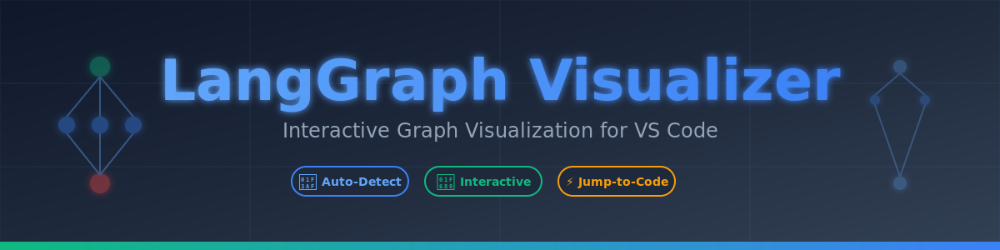

<div align="center">



# LangGraph Visualizer and Debugger

**Interactive LangChain Agent Debugging & LangGraph Visualization for VS Code**

_The professional-grade debugger for LangChain agents and LangGraph workflows_

[](https://marketplace.visualstudio.com/items?itemName=smazee.langgraph-visualizer)
[](https://marketplace.visualstudio.com/items?itemName=smazee.langgraph-visualizer)
[](https://marketplace.visualstudio.com/items?itemName=smazee.langgraph-visualizer)
[](./LICENSE)
[](./CHANGELOG.md)

[Features](#-features) • [Quick Start](#-quick-start) • [Usage](#-usage) • [Debug Your Agents](#-debug-your-agents) • [Examples](#-examples) • [Development](#-development)

</div>

---

## 🎥 See It In Action

### Debugger

<div align="center">


_Debugg using your python environment - live highlight of executing agent and state values_

</div>

### Time Capsule

<div align="center">


_Store the execution and state value on each agent, can rewind and watch anytime_

</div>

### Visualizer

<div align="center">


_Real-time visualization, interactive debugging, and intelligent navigation for your LangChain agents_

</div>

---

## ✨ Features

### 🐛 **Agent Debugging & Execution Tracing**

Professional-grade debugging tools for LangChain agents:

- **Step-by-Step Execution**: Execute agents node-by-node with breakpoints
- **State Tracking**: Monitor state changes at every step
- **Execution Timeline**: Time Capsule feature to replay and inspect execution history
- **Error Detection**: Immediate error reporting with detailed tracebacks
- **Variable Inspection**: Inspect node inputs, outputs, and state transformations

### 🎯 **Auto-Detection & Real-Time Analysis**

Intelligent graph detection and parsing:

- Automatically detects LangGraph code in Python files
- Supports StateGraph, MessageGraph, and Graph types
- Real-time detection as you code
- Status bar indicator when graphs are detected
- Multi-file graph support with automatic traversal

### 🚀 **Interactive Visualization**

Beautiful, responsive graph visualization:

- Powered by Cytoscape.js for performance
- Drag and reposition nodes freely
- Zoom and pan with smooth controls
- Hierarchical auto-layout (Dagre algorithm)
- Color-coded nodes (Start, Regular, End, Conditional)
- Supports complex multi-agent architectures

### 🔄 **Smart Code Navigation**

Intelligent jumping between visualization and code:

- Click any node to jump to its definition
- Shows line numbers and function names
- Context-aware node details
- Bidirectional navigation support
- Quick access to imported functions across files

### 🔍 **Advanced Search & Filter**

Find and highlight nodes instantly:

- Real-time search with keyboard shortcut (`Cmd/Ctrl + F`)
- Highlights all matching nodes
- Case-insensitive search
- Filter by node type or state
- Clear with `Esc`

### 📊 **State Visualization Panel**

Complete state management overview:

- View all state field definitions
- Display types and default values
- Annotated field metadata
- Live state updates during execution
- Copy state structure as JSON
- Supports TypedDict, dataclass, and MessagesState

### 📸 **Export & Documentation**

Save and share your workflow:

- Export graph as high-resolution PNG
- Perfect for documentation and presentations
- One-click download with proper styling
- Maintains visual hierarchy and colors

### 🛠️ **Comprehensive Logging**

Detailed execution logs for debugging:

- Node start/end events with timing
- State update tracking
- Error and warning messages
- Custom log entries from your code
- Exportable execution history

<table>
<tr>
<td width="50%">

**Interactive State Debugging**


_Monitor state changes at every execution step_

</td>
<td width="50%">

**Multi-Agent Architecture Support**


_Debug complex multi-agent systems with tool integrations_

</td>
</tr>
<tr>
<td colspan="2">

**Multi-File Graph Support**


_Automatically trace and visualize graphs across your entire codebase_

</td>
</tr>
</table>

---

## 🚀 Quick Start

### Installation

1. **From VS Code Marketplace** (Recommended)

   - Open VS Code
   - Press `Cmd/Ctrl + Shift + X` to open Extensions
   - Search for "LangGraph Visualizer"
   - Click **Install**

2. **From VSIX File**

   ```bash
   code --install-extension langgraph-visualizer-0.3.0.vsix
   ```

3. **Requirements**
   - VS Code 1.80.0 or higher
   - Python 3.8+ (for agent debugging)
   - LangChain and LangGraph installed in your Python environment

### First Use

1. Open any Python file with LangGraph code
2. Look for the **$(graph) LangGraph** icon in the status bar (bottom right)
3. Click the icon to visualize your graph
4. Start debugging your agents!

---

## 🐛 Debug Your Agents

### Starting a Debug Session

1. **Open Python File**: Load a file with LangGraph/LangChain agent code
2. **Start Debugger**: Click "$(debug-start) LangGraph: Start Debug Session" in status bar or use Command Palette (`Cmd/Ctrl + Shift + P`)
3. **Provide Input**: Fill in the initial state/input values in the dialog
4. **Watch Execution**: View real-time execution with visualization and logging

### Debug Features

| Feature             | How To                           | Description                           |
| ------------------- | -------------------------------- | ------------------------------------- |
| **🔴 Breakpoints**  | Click breakpoint button on nodes | Pause execution at specific nodes     |
| **⏸️ Pause**        | Click pause button               | Suspend execution without stopping    |
| **▶️ Resume**       | Click resume button              | Continue execution from pause point   |
| **⬇️ Step**         | Click step button                | Execute one node at a time            |
| **⏹️ Stop**         | Click stop button                | Terminate execution                   |
| **📺 Time Capsule** | View in execution timeline       | Replay and inspect any execution step |
| **📊 Live State**   | Watch state panel                | See state changes in real-time        |
| **📋 Logs**         | View log panel                   | Complete execution trace              |

### Example: Debugging an Agent

```python
from langgraph.graph import StateGraph
from langchain_core.messages import BaseMessage, HumanMessage
from typing import Annotated, TypedDict
from langgraph.graph.message import add_messages

class State(TypedDict):
    messages: Annotated[list[BaseMessage], add_messages]

def agent_node(state: State):
    """Your agent logic here"""
    return {"messages": [HumanMessage(content="Agent response")]}

# Create and debug your agent
graph = StateGraph(State)
graph.add_node("agent", agent_node)
graph.set_entry_point("agent")
app = graph.compile()

# Now open this file in VS Code and start debugging!
# The visualization will show your agent structure
# Use Step button to walk through execution
```

---

## 🎮 Usage

### Opening the Visualizer

There are multiple ways to open the graph visualizer:

| Method              | How To                                                   | Use Case                       |
| ------------------- | -------------------------------------------------------- | ------------------------------ |
| **Status Bar**      | Click `$(graph) LangGraph` icon when detected            | Quick access when viewing code |
| **Command Palette** | `Cmd/Ctrl + Shift + P` → "Show LangGraph Visualization"  | Any time from any window       |
| **Context Menu**    | Right-click in editor → "Show LangGraph Visualization"   | Visual discovery               |
| **File Explorer**   | Right-click Python file → "Show LangGraph Visualization" | Before opening file            |

### Interacting with the Graph

<table>
<tr>
<th>Action</th>
<th>How To</th>
<th>Result</th>
</tr>
<tr>
<td><strong>🖱️ Drag Nodes</strong></td>
<td>Click and drag any node</td>
<td>Repositions the node for better layout</td>
</tr>
<tr>
<td><strong>🔍 Zoom In/Out</strong></td>
<td>Mouse wheel or zoom buttons</td>
<td>Zoom to focus on details or see full graph</td>
</tr>
<tr>
<td><strong>👆 Pan</strong></td>
<td>Click and drag background</td>
<td>Move around larger graphs</td>
</tr>
<tr>
<td><strong>🎯 Select Node</strong></td>
<td>Click any node</td>
<td>Shows node details and highlights in code</td>
</tr>
<tr>
<td><strong>🔎 Search</strong></td>
<td><code>Cmd/Ctrl + F</code> or search box</td>
<td>Highlights all matching nodes</td>
</tr>
<tr>
<td><strong>📐 Center Graph</strong></td>
<td>Click center button</td>
<td>Fits entire graph to viewport</td>
</tr>
<tr>
<td><strong>📸 Export</strong></td>
<td>Click export button</td>
<td>Downloads high-res PNG image</td>
</tr>
<tr>
<td><strong>⚙️ Toggle Layout</strong></td>
<td>Click layout button</td>
<td>Switch between layout algorithms</td>
</tr>
</table>

### Understanding the Visualization

#### Node Colors & Types

- 🟢 **Green** = Start/Entry Point - Where execution begins
- 🔵 **Blue** = Regular/Process Node - Standard processing node
- 🔴 **Red** = End/Finish Point - Where execution concludes
- 🟣 **Purple** = Conditional Node - Routes based on conditions
- 🟠 **Orange** = Tool/Action Node - External API or tool call

#### Edge Types

- **Solid Line** = Direct Edge - Always executed
- **Dashed Line** = Conditional Edge - Executed based on condition
- **Arrow Direction** = Flow of execution

#### State Panel

The collapsible state panel (top-right) displays:

- **Field Names** and their types with full type hints
- **Default Values** or example values for each field
- **Annotations** (e.g., `add_messages` for message reducers)
- **Metadata** about field behavior
- **Copy to Clipboard** button (📋) for schema sharing

---

## 🛠️ Advanced Usage

### Working with Multi-File Projects

The extension automatically traverses imports to build complete graph representations:

```python
# main.py
from workers import agent_node, tool_node
from langgraph.graph import StateGraph

graph = StateGraph(State)
graph.add_node("agent", agent_node)
graph.add_node("tool", tool_node)
# ... The visualizer will find and include nodes from workers.py
```

### Debugging Multi-Agent Systems

For supervisor-worker patterns and complex architectures:

1. **View Full Architecture**: The visualization shows the complete multi-agent setup
2. **Debug Supervision**: Step through supervisor routing logic
3. **Trace Agent Calls**: See which agent handles each task
4. **Monitor State Flow**: Track state transformations across agents

### Custom State Handling

Supports various state definition patterns:

```python
# TypedDict
class State(TypedDict):
    messages: Annotated[list, add_messages]
    user_input: str

# Dataclass
@dataclass
class State:
    messages: list
    user_input: str

# MessagesState
class State(MessagesState):
    additional_field: str
```

---

## 📝 Examples

### Simple Agent Graph

```python
from typing import TypedDict
from langgraph.graph import StateGraph

class State(TypedDict):
    messages: list[str]
    user_input: str
    response: str

# Create graph
graph = StateGraph(State)

# Add nodes
graph.add_node("start", start_function)
graph.add_node("process", process_function)
graph.add_node("end", end_function)

# Add edges
graph.add_edge("start", "process")
graph.add_edge("process", "end")

# Set entry point
graph.set_entry_point("start")

# Compile and run
app = graph.compile()
result = app.invoke({"messages": [], "user_input": "Hello"})
```

**Visualization**: Linear flow with 3 nodes (green → blue → red)

### Conditional Routing with Tools

```python
from langgraph.graph import StateGraph

graph = StateGraph(State)

graph.add_node("agent", agent_node)
graph.add_node("tool", tool_node)
graph.add_node("end", end_node)

# Conditional edge based on agent decision
graph.add_conditional_edges(
    "agent",
    should_continue,
    {
        "continue": "tool",
        "end": "end"
    }
)

# Tool loops back to agent
graph.add_edge("tool", "agent")
graph.set_entry_point("agent")

app = graph.compile()
```

**Visualization**: Diamond shape with conditional (dashed) edges. Perfect for debugging tool-using agents.

### Multi-Agent Supervisor System

```python
from langgraph.graph import StateGraph

graph = StateGraph(State)

# Add supervisor and worker nodes
graph.add_node("supervisor", supervisor_node)
graph.add_node("researcher", researcher_node)
graph.add_node("writer", writer_node)
graph.add_node("reviewer", reviewer_node)

# Supervisor routes to different agents
graph.add_conditional_edges(
    "supervisor",
    route_to_agent,
    {
        "research": "researcher",
        "write": "writer",
        "review": "reviewer",
        "finish": "end"
    }
)

# All agents report back to supervisor
graph.add_edge("researcher", "supervisor")
graph.add_edge("writer", "supervisor")
graph.add_edge("reviewer", "supervisor")

graph.set_entry_point("supervisor")
app = graph.compile()
```

**Visualization**: Star topology with supervisor at center. Ideal for debugging multi-agent coordination.

### With Debugging

```python
# The same code works with debugging enabled
# Open in VS Code and click "Start Debug Session"
# You'll be able to:
# 1. Step through each node execution
# 2. Inspect state at each step
# 3. Set breakpoints on nodes
# 4. Review execution timeline with Time Capsule
# 5. See node inputs/outputs and timing
```

---

## 🎯 Supported Patterns

### Graph Types

- ✅ `StateGraph` - State-based graphs
- ✅ `MessageGraph` - Message-based graphs
- ✅ `Graph` - Basic graphs

### Node Operations

- ✅ `.add_node("name", function)` - Add nodes
- ✅ `.add_edge("from", "to")` - Direct edges
- ✅ `.add_conditional_edges("from", func, {...})` - Conditional routing
- ✅ `.set_entry_point("node")` - Set start node
- ✅ `.set_finish_point("node")` - Set end node

### State Definitions

- ✅ **TypedDict**: `class State(TypedDict):`
- ✅ **Dataclass**: `@dataclass class State:`
- ✅ **Annotated**: `field: Annotated[type, annotation]`
- ✅ **MessagesState**: `class State(MessagesState):`

---

## 🛠️ Development

Want to contribute? Great! Here's how to get started:

### Setup

```bash
# Clone the repository
git clone https://github.com/Naveenkumarar/langgraph-visualizer.git
cd langgraph-visualizer

# Install dependencies
npm install

# Open in VS Code
code .

# Press F5 to launch Extension Development Host
```

### Building

```bash
# Compile TypeScript
npm run compile

# Watch mode (auto-compile on changes)
npm run watch

# Package extension
vsce package
```

### Testing

```bash
# Run linter
npm run lint

# Test with sample files
# Open any file in test_samples/ directory
```

### Project Structure

```
langgraph-visualizer/
├── src/
│   ├── extension.ts          # Main extension entry point
│   ├── graphDetector.ts      # Detects LangGraph code
│   ├── graphParser.ts        # Parses graph structure
│   ├── fileTraverser.ts      # Multi-file graph support
│   └── webviewProvider.ts    # Visualization UI
├── media/
│   ├── banner.png            # README banner
│   ├── icons/                # Extension icons
│   └── webview.css           # Visualization styles
├── test_samples/             # Example LangGraph files
└── scripts/                  # Build scripts
```

---

## 📋 Requirements

- **VS Code**: Version 1.80.0 or higher (active development)
- **Python**: 3.8+ (for debug features)
- **LangGraph**: Latest version recommended
- **LangChain**: For agent debugging features

No additional Python installation required for visualization - it works entirely within VS Code.

---

## 🗺️ Roadmap

### ✅ Released in v0.3.0

- [x] **Professional Agent Debugging** - Full step-by-step execution control
- [x] **Time Capsule Feature** - Replay and inspect execution history
- [x] **Breakpoint Support** - Pause execution at specific nodes
- [x] **Advanced Logging** - Comprehensive execution traces
- [x] **Live State Monitoring** - Real-time state visualization
- [x] **Multi-Agent System Support** - Supervisor-worker patterns
- [x] **Enhanced Error Handling** - Detailed error reporting
- [x] **Production-Ready Debugging** - Enterprise-grade tooling

### 🚀 Planned for Future Releases

- [ ] Custom color schemes and themes
- [ ] Save and restore graph layouts
- [ ] Animation of execution flow
- [ ] Graph validation and optimization suggestions
- [ ] Multiple layout algorithms (force-directed, radial, etc.)
- [ ] Subgraph collapsing and expansion
- [ ] Performance profiling and bottleneck detection
- [ ] Integration with popular LLM frameworks
- [ ] Cloud-based debugging session management
- [ ] Collaborative debugging sessions
- [ ] Graph comparison tools
- [ ] Execution history export (JSON, CSV)

---

## 💡 Use Cases

### 🤖 LLM Application Developers

Debug complex agent workflows with step-by-step execution and state inspection.

### 🔬 ML/AI Researchers

Visualize and analyze multi-agent systems and workflow patterns.

### 🏢 Enterprise Teams

Professional-grade debugging for production LangChain applications.

### 📚 Educational

Learn LangGraph concepts through interactive visualization and debugging.

### 🧪 Testing & QA

Verify agent behavior under different inputs with reproducible debugging.

---

## 🗺️ Project Structure

```
langgraph-visualizer/
├── src/
│   ├── extension.ts          # Main extension entry point
│   ├── graphDetector.ts      # Detects LangGraph code patterns
│   ├── graphParser.ts        # Parses graph structure and state
│   ├── fileTraverser.ts      # Multi-file graph resolution
│   ├── debugSession.ts       # Debug session management
│   ├── debugServer.ts        # WebSocket server for debug protocol
│   ├── pythonRuntime.ts      # Python runtime wrapper and callbacks
│   └── webviewProvider.ts    # Visualization UI and interactions
├── media/
│   ├── banner.png            # README banner
│   ├── icons/                # Extension icons (preserved)
│   ├── screenshots/          # Feature showcase images
│   └── webview.css           # Visualization styles
├── test_samples/             # Example LangGraph files for testing
├── scripts/                  # Build and utility scripts
├── package.json              # Extension manifest
├── tsconfig.json             # TypeScript configuration
└── CHANGELOG.md              # Version history and features
```

---

## 🤝 Contributing

Contributions are welcome! Whether you want to fix bugs, add features, or improve documentation:

- 🐛 [Report bugs](https://github.com/Naveenkumarar/langgraph-visualizer/issues/new?labels=bug)
- 💡 [Suggest features](https://github.com/Naveenkumarar/langgraph-visualizer/issues/new?labels=enhancement)
- 🔧 [Submit pull requests](https://github.com/Naveenkumarar/langgraph-visualizer/pulls)
- 📖 [Improve documentation](https://github.com/Naveenkumarar/langgraph-visualizer/blob/main/CONTRIBUTING.md)

See [CONTRIBUTING.md](./CONTRIBUTING.md) for detailed guidelines.

### Development Setup

```bash
# Clone and setup
git clone https://github.com/Naveenkumarar/langgraph-visualizer.git
cd langgraph-visualizer
npm install

# Development
npm run watch          # Watch mode
npm run compile        # One-time compilation
npm run lint           # Code quality check

# Testing
npm test               # Run tests
# Open any file in test_samples/ to test visualization
```

---

## 📄 License

MIT License - see [LICENSE](./LICENSE) file for details.

Created with ❤️ for the LangChain and LangGraph communities.

---

## 🙏 Acknowledgments

- **[LangGraph](https://github.com/langchain-ai/langgraph)** - Amazing workflow orchestration framework
- **[LangChain](https://github.com/langchain-ai/langchain)** - Powering agent and chain applications
- **[Cytoscape.js](https://js.cytoscape.org/)** - Beautiful graph visualization library
- **[Dagre](https://github.com/dagrejs/dagre)** - Excellent graph layout algorithm
- **VS Code API** - Extensibility platform

---

<div align="center">

**[⬆ Back to Top](#langraph-agent-debugger)**

Built for developers by developers. Made with ❤️ by [Naveen Kumar](https://github.com/Naveenkumarar)

If you find this extension helpful, please ⭐ star the repo and share it with others!

[](https://github.com/Naveenkumarar/langgraph-visualizer)
[](https://github.com/Naveenkumarar)

</div>
